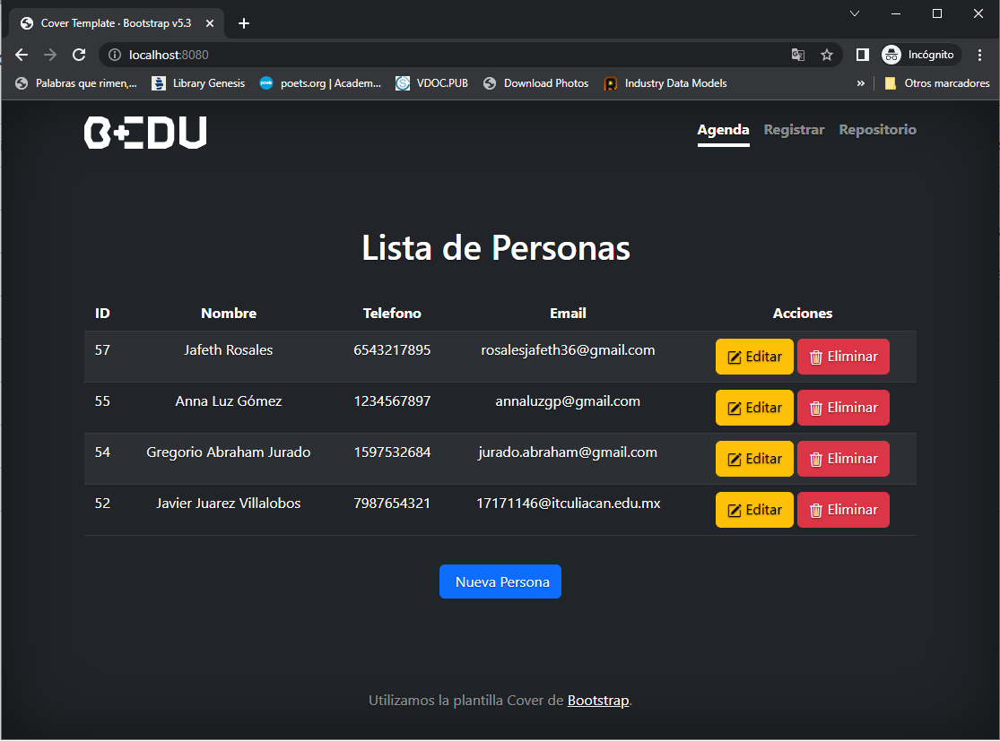

# CONEXIÓN A BASE DE DATOS CON SPRING DATA

Almacenar la información de la agenda en MySQL y despues recuperarlas.

### OBJETIVO

- Almacenar la información de la agenda en una base de datos relacional MySQL.
- Recuperar las personas contenidas en la agenda desde la base de datos para mostrarlas en pantalla.
- Que la información ingresada no desaparezca al momento de reiniciar la aplicación.

### DESARROLLO

1. Se reemplazó el `Set` donde se almacenaba la información de la agenda por una base de datos relacional MySQL, de esta forma, al reiniciar la aplicación la información sigue disponible.
2. Se integraron las depencias de Spring data JPA y el driver de MySQL en el archivo `build.gradle`.
3. Se reemplazó la clase que guardaba los datos en memoria por un repositorio de Spring Data.
4. Se convirtió la clase `Persona` en una entidad de JPA.
5. Los elementos de la aplicación se conectaron a través de servicios y controladores de Spring MVC.
6. Se configuró el uso de h2 console para consultar la base de datos.
7. Se modificó la plantilla html para incorporar el uso de fragmentos html reutilizables al desplegar la lista de personas de la agenda.

#### El proyecto funcionando se ve de la siguiente manera:

- Conexión a base de datos con H2 Console:

 

[**`Siguiente`** -> Sesión 02](../Sesion2/Postwork)

[**`Regresar`**](./)
